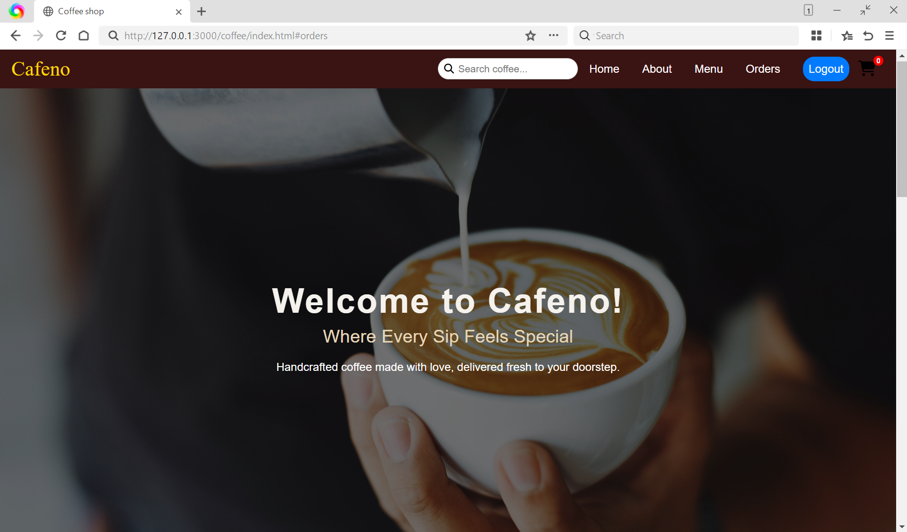
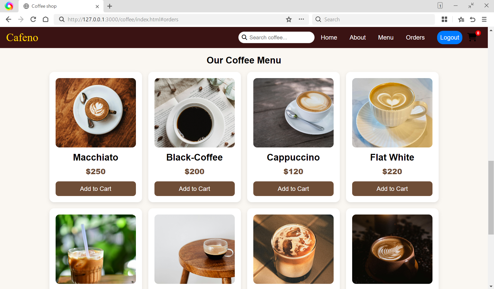
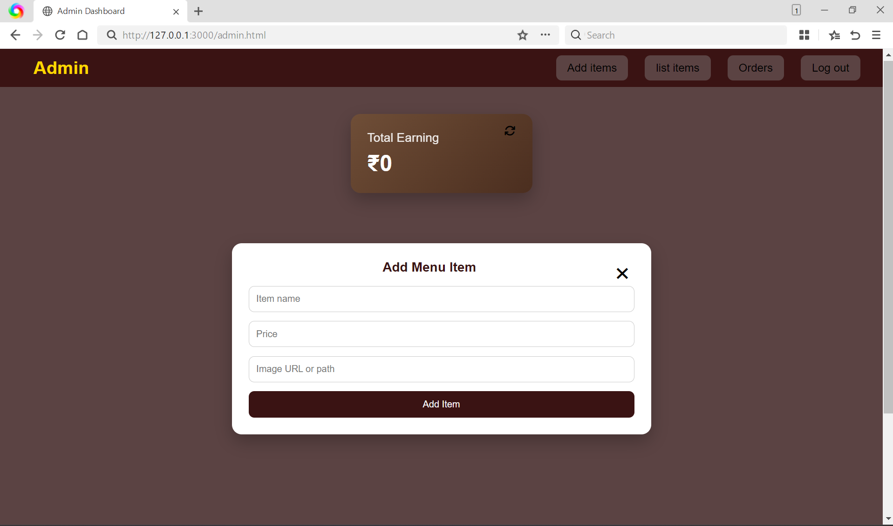

# ☕ CAFENO — Coffee Shop Web Application  

CAFENO is a **fully responsive coffee shop web application** featuring separate **User** and **Admin** panels.  
It simulates a real-world food ordering system with **secure authentication, real-time order tracking, menu management, and earnings monitoring**, built using modern web technologies.

The system consists of **two separate web panels** working together seamlessly:

- 👤 **User Website** – for customers to browse the menu, place orders & track status  
- 🛠️ **Admin Website** – for café owners/staff to manage menu, orders & earnings  

---
## 📂 Project Structure  

```text
cafeno/
│
├── index.html        # User interface
├── admin.html        # Admin dashboard
├── login.html        # Login page
├── signup.html       # Signup page
├── style.css         # User styling
├── admin.css         # Admin styling
├── login.css         # Login/Signup styling
├── script.js         # User logic
├── admin.js          # Admin logic
├── login.js          # Login/Signup logic
├── firebase.js       # Firebase configuration
└── README.md
```
---

## 🚀 Features  

### 🌐 User Website

✅ Clean & responsive UI (mobile, tablet, desktop)

☕ Dynamic coffee menu fetched from Firebase

🛒 Cart system with real-time item updates

📍 Delivery address input before order confirmation

📝 Order history with live order status updates

🔒 Secure login using Firebase Authentication

💵 Cash on Delivery (COD) support

⏱️ Latest orders shown first using date-based sorting


### 🛠️ Admin Dashboard

📋 Add, update, activate, or deactivate menu items

🙈 Inactive items automatically hidden from users

🚚 Manage orders with controlled status flow
    (Pending → Processing → Delivered — no reverse allowed)

💰 Total earnings calculation based only on Delivered orders

🔄 Reset earnings feature for tracking sales after last reset

📊 Real-time updates using Firebase Firestore listeners

🔐 Role-based admin access control


## 🧩 Tech Stack  

**Frontend:** HTML5, CSS3, JavaScript (ES6)

**Backend & Database:** Firebase Firestore

**Authentication:** Firebase Authentication

**Version Control:** Git & GitHub

## Setup & Installation

Clone the repository:  
```bash
git clone https://github.com/adiba-anwar01/Cafeno-coffeeShop.git
```
Open the Cafeno project in your code editor.

Add your Firebase configuration file (`firebase-config.js`).

Enable Firebase Authentication, Firestore / Realtime Database & Storage in the Firebase console.

Start a local server (for example, using the **Live Server** extension in VS Code) or simply open `index.html` in your browser.

Build & run! 🚀


## ✨ Key Highlights  

🔁 Real-time Firestore listeners

🔒 Role-based authentication (Admin / User)

📦 Clean, modular ES6 JavaScript

📱 Mobile-first responsive design

🧠 Smart UI state handling without page refresh


## 🌱 Current Scope 

✅ Single coffee shop support

✅ Cash on Delivery

✅ Real-time orders & menu management

✅ Admin + User role separation

✅ Responsive UI


## 🔮 Future Enhancements

💳 Online payments (UPI / Razorpay / Stripe)

📧 Email & WhatsApp order notifications

⭐ Ratings & reviews for menu items

📊 Advanced admin analytics dashboard

🛍️ Re-order & favorites feature

🌍 Multi-branch / multi-store support


## 🎨 Customization Guidelines

🖼️ Replace branding assets (logo, icons)

☕ Add new categories & products easily

💰 Modify currency & pricing logic

🔐 Extend admin permissions if required


## 📸 Screenshots

### 💻 Desktop View

| 🏠 **User Home** |
|:--:|
| [](screenshots/user_home.png) |

| 📋 **User Menu** |
|:--:|
| [](screenshots/user_menu.png) |

| 🛒 **User Cart** |
|:--:|
| [](screenshots/user_cart.png) |

| 🛠️ **Admin – Add Item** |
|:--:|
| [](screenshots/admin_add_item.png) |

☕ Brewing a better café experience, one screen at a time.


## ❤️ Why CAFENO?

Real-world admin + customer workflow

Demonstrates practical Firebase usage

Clean UI/UX with business logic

Built to scale beyond a single café


## 🤝 Contributing

Have ideas to enhance **Cafeno**?
Feel free to fork this repository, open issues, or submit pull requests.  
Thoughtful contributions, improvements, and feedback are always welcome.

📬 Contact

📧 **Email:** adibadeveloper02@gmail.com  

Crafted with passion and attention to detail by **Adiba**,  
focused on building clean, scalable, and user-friendly web experiences.

⚡ **Cafeno** — where modern web design meets a seamless café experience.  
Designed today for one coffee shop, ready to scale for many tomorrow.


